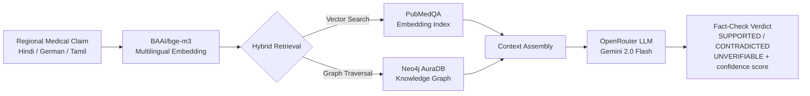

# Medical GraphRAG Fact-Checker

<div align="center">

[](https://www.python.org/)
[](https://github.com/sourav1243/Medical-GraphRAG-FactChecker/actions/workflows/test.yml)
[](LICENSE)
[](https://neo4j.com/cloud/aura/)
[](https://openrouter.ai/)

**An AI-powered multilingual medical fact-checking system that uses Retrieval-Augmented Generation (RAG) and Knowledge Graphs to verify health claims against peer-reviewed medical literature.**

</div>

---

## Quick Start

```bash
git clone https://github.com/sourav1243/Medical-GraphRAG-FactChecker.git && cd Medical-GraphRAG-FactChecker
cp .env.example .env && nano .env   # Add your Neo4j + OpenRouter credentials
docker compose up --build           # Starts Neo4j + runs the pipeline
```

---

## Table of Contents

- [Overview](#overview)
- [Features](#features)
- [Architecture](#architecture)
- [Tech Stack](#tech-stack)
- [Project Structure](#project-structure)
- [Getting Started](#getting-started)
  - [Prerequisites](#prerequisites)
  - [Installation](#installation)
  - [Configuration](#configuration)
- [Usage](#usage)
  - [Step 1: Fetch Medical Data](#step-1-fetch-medical-data)
  - [Step 2: Scrape Claims](#step-2-scrape-claims)
  - [Step 3: Generate Embeddings](#step-3-generate-embeddings)
  - [Step 4: Build Knowledge Graph](#step-4-build-knowledge-graph)
  - [Step 5: Run Fact-Checking](#step-5-run-fact-checking)
- [Docker Usage](#docker-usage)
- [Evaluation](#evaluation)
- [Contributing](#contributing)
- [License](#license)
- [Acknowledgments](#acknowledgments)

---

## Overview

Medical misinformation, especially in regional languages, poses a significant threat to public health. This project implements a sophisticated **GraphRAG-based Medical Fact-Checker** that:

1. **Fetches** peer-reviewed medical knowledge from PubMedQA
2. **Embeds** medical texts into a multilingual vector space
3. **Constructs** a Knowledge Graph in Neo4j with medical entities and relationships
4. **Fact-checks** health claims using hybrid retrieval (vector similarity + graph traversal)
5. **Supports** multiple languages (Hindi, German, Tamil, Telugu, English)

---

## Features

| Feature | Description |
|---------|-------------|
| **Multilingual Support** | Processes claims in 5+ languages with automatic translation |
| **Hybrid Retrieval** | Combines vector similarity search with knowledge graph traversal |
| **Entity Extraction** | Automatically extracts medical entities (Diseases, Drugs, Symptoms, Treatments) |
| **Relationship Mapping** | Builds semantic relationships between medical concepts |
| **Confidence Scoring** | Provides probability-based verdict with confidence scores |
| **Neo4j Integration** | Stores structured medical knowledge as an interactive graph |
| **RAG Pipeline** | Uses state-of-the-art Retrieval-Augmented Generation for fact-checking |

---

## Architecture



### Data Flow

1. **Ingestion Phase**: PubMedQA data → Embedding Model → Vector Store + Neo4j Graph
2. **Query Phase**: User Claim → Translation → Hybrid Retrieval → LLM Analysis → Verdict

---

## Tech Stack

| Layer | Technology |
|-------|-------------|
| **Language** | Python 3.10+ |
| **Data Ingestion** | HuggingFace Datasets |
| **Embeddings** | Sentence-Transformers (BAAI/bge-m3, 1024-dim) |
| **Vector Store** | NumPy (Local) |
| **Graph Database** | Neo4j AuraDB (Free Tier) |
| **LLM** | Google Gemini 2.0 Flash (via OpenRouter) |
| **Orchestration** | Custom Python Pipeline |

---

## Project Structure

```
Medical-GraphRAG-FactChecker/
├── .github/
│   └── workflows/
│       └── test.yml              # CI/CD workflow
├── src/
│   ├── __init__.py
│   ├── config.py                   # Configuration management (pydantic-settings)
│   ├── constants.py                # Constants and enums
│   ├── graph.py                    # Neo4j graph queries
│   ├── logger.py                   # Structured logging
│   ├── search.py                   # Vector search functionality
│   └── utils.py                    # Utility functions
├── scripts/
│   ├── 01_fetch_pubmedqa.py       # Fetch PubMedQA dataset
│   ├── 02_scrape_claims.py        # Scrape regional claims
│   ├── 03_embed_and_index.py      # Generate embeddings
│   ├── 04_build_knowledge_graph.py # Build Neo4j graph
│   └── 05_fact_check_pipeline.py  # Run fact-checking
├── tests/
│   ├── test_config.py              # Config tests
│   ├── test_utils.py               # Utils tests
│   ├── test_search.py              # Search tests
│   ├── test_neo4j_mock.py          # Neo4j mock tests
│   └── test_stress.py              # Stress tests
├── data/
│   ├── pubmedqa_clean.json        # Clean PubMed data
│   ├── scraped_claims.json        # Scraped claims
│   ├── golden_dataset.json        # Evaluation dataset
│   └── fact_check_results.json    # Results output
├── embeddings/                     # Generated embeddings
├── .env.example                    # Environment template
├── .gitignore                      # Git ignore rules
├── LICENSE                         # Apache 2.0 License
├── README.md                       # This file
├── CHANGELOG.md                    # Version history
├── SECURITY.md                     # Security policy
├── requirements.txt                # Python dependencies
├── pyproject.toml                 # Project metadata
├── Dockerfile                     # Docker build file
├── docker-compose.yml             # Docker Compose
└── evaluate_rag.py                # Evaluation script
```

---

## Getting Started

### Prerequisites

- Python 3.10 or higher
- Neo4j AuraDB account (free tier)
- OpenRouter API key (for LLM access)

### Installation

1. **Clone the repository:**
```bash
git clone https://github.com/sourav1243/Medical-GraphRAG-FactChecker.git
cd Medical-GraphRAG-FactChecker
```

2. **Create virtual environment:**
```bash
# Using venv
python -m venv venv
source venv/bin/activate  # Linux/Mac
# or
venv\Scripts\activate     # Windows

# Using conda
conda create -n medigraph python=3.10
conda activate medigraph
```

3. **Install dependencies:**
```bash
pip install -r requirements.txt
```

### Configuration

1. **Copy the environment template:**
```bash
cp .env.example .env
```

2. **Configure environment variables in `.env`:**

```env
# Neo4j AuraDB Credentials
NEO4J_URI=neo4j+s://your-instance.databases.neo4j.io
NEO4J_USERNAME=neo4j
NEO4J_PASSWORD=your_password_here

# OpenRouter API Key (for LLM)
OPENROUTER_API_KEY=sk-or-v1-xxxxxxxxxxxxxxxxxxxxxxxxxxxxxxxx
```

3. **Get Neo4j credentials:**
   - Create free account at [Neo4j AuraDB](https://neo4j.com/cloud/aura/)
   - Create new AuraDB instance
   - Copy connection details to `.env`

4. **Get OpenRouter API key:**
   - Sign up at [OpenRouter.ai](https://openrouter.ai/)
   - Generate API key
   - Add to `.env`

---

## Usage

### Step 1: Fetch Medical Data

Download and clean PubMedQA dataset:
```bash
python scripts/01_fetch_pubmedqa.py
```

**Output:** `data/pubmedqa_clean.json` with ~1000 labeled medical Q&A pairs.

### Step 2: Scrape Claims

Collect regional medical claims (or use sample data):
```bash
python scripts/02_scrape_claims.py
```

**Output:** `data/scraped_claims.json` with claims in multiple languages.

### Step 3: Generate Embeddings

Create vector embeddings for medical literature:
```bash
python scripts/03_embed_and_index.py
```

**Output:** `embeddings/pubmed_embeddings.npy` (N × 1024 matrix).

### Step 4: Build Knowledge Graph

Construct medical knowledge graph in Neo4j:
```bash
python scripts/04_build_knowledge_graph.py
```

**This step:**
- Extracts medical entities using LLM
- Creates entity nodes (Disease, Drug, Symptom, Treatment)
- Builds relationship edges (TREATS, CAUSES, PREVENTS)
- Stores chunks with embeddings for hybrid retrieval

### Step 5: Run Fact-Checking

Execute the fact-checking pipeline:
```bash
python scripts/05_fact_check_pipeline.py
```

**Output:** `data/fact_check_results.json` with verdicts and explanations.

---

## Docker Usage

### Build and Start

```bash
docker compose up --build
```

### Run fact-checking in Docker

```bash
docker compose exec app python scripts/05_fact_check_pipeline.py
```

### Access Neo4j Browser

Open http://localhost:7474

---

## Evaluation

This system was benchmarked against naive vector-only RAG on a curated 20-claim golden dataset.
Full results: [benchmark_results.md](benchmark_results.md)

| Metric | GraphRAG | Naive RAG |
|---|---|---|
| F1 Score (weighted) | *run evaluate_rag.py* | *run evaluate_rag.py* |
| Accuracy | *run evaluate_rag.py* | *run evaluate_rag.py* |

Run evaluation:
```bash
python evaluate_rag.py
```

---

## Contributing

Contributions are welcome! Please read our [Contributing Guidelines](CONTRIBUTING.md) before submitting PRs.

### Development Setup

```bash
# Install dev dependencies
pip install -r requirements.txt

# Run tests
pytest tests/ -v --cov=src

# Format code
black src/ tests/
isort src/ tests/
```

---

## License

This project is licensed under the Apache License 2.0. See the [LICENSE](LICENSE) file for details.

---

## Acknowledgments

- [PubMedQA Dataset](https://github.com/pubmedqa) - Medical Q&A dataset
- [Neo4j](https://neo4j.com/) - Graph database
- [HuggingFace](https://huggingface.co/) - Embedding models
- [OpenRouter](https://openrouter.ai/) - LLM API aggregation
- [Sentence-Transformers](https://sbert.net/) - Embedding library

---

<div align="center">

**Star this repository if you found it helpful!**

*Built with care by [Sourav Kumar Sharma](https://github.com/sourav1243)*

</div>
